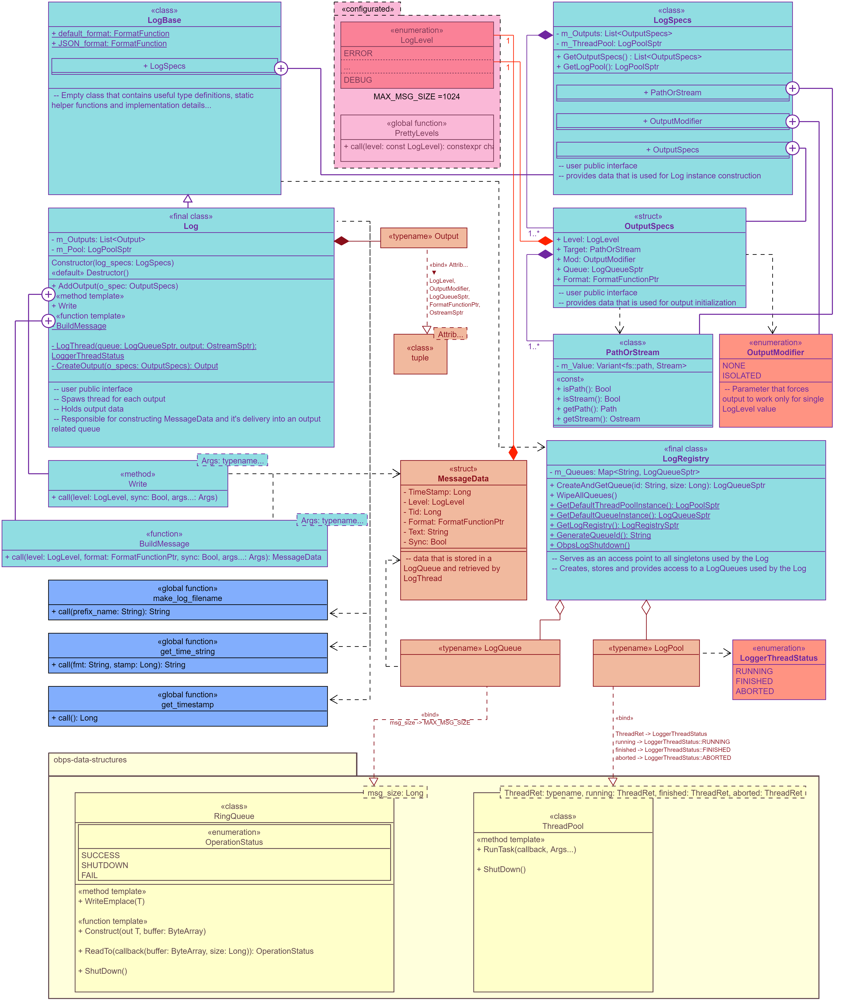

# ObpsLog
ObpsLog is a multithreaded c++ logging library. Uses c++20 standard.

## Features
* User-configured severity levels.
* Easy on/off at compile time (no Runtime overhead).
* Global and scope based functionalities
* Thread-Safe
* Fast Writes (IO processed in separate thread)
* Supports files and Standard IO (iostream)
* Multiple output targets per Log instance. Allows user to split messages into different files by severity.
* Output message that matches single severity level. (for instance: output only INFO messages into a separate file...)
* Mute/Unmute some severity levels at Runtime.
* User custom formatting.

## Usage
An API provides you GLOBAL_LOG and SCOPE_LOG functionality.
First can be used for simple cases, where the second one is bounded by function scope and allows more precise configuring.

Both ways are thread safe.
Each Log instance spawns separate thread and uses separate message queue by default.

## example:
### main.c
``` c++
#include <thread>

GLOBAL_LOG({LogLevel::ERROR, std::cerr}); // declare and cofigure global log

void thread_foo()
{
    SCOPE_LOG({LogLevel::INFO, std::cout}); // declare and configure scope log 
    
    INFO("Important message");  // goes to scope log

    int n = 42;
    DEBUG("n = ", n); // goes to scope log

    G_ERROR("Something terrible happend!"); // goes to global log


    MUTE(LogLevel::INFO) // mutes scope log INFO
    INFO("Ooops");  // muted (is lost for ever)
    
    UNMUTE(LogLevel::INFO) // unmutes scope log INFO]
    INFO("Yey");  // goes to scope log
}

void main()
{
    //  there is a sync version for each call that also flushes an output stream
    G_ERROR_SYNC("...");

    std::jthread(thread_foo);

    OBPS_LOG_TEARDOWN(); //-> finalize threads in global thread pool 
}
```

## Class Diagram


